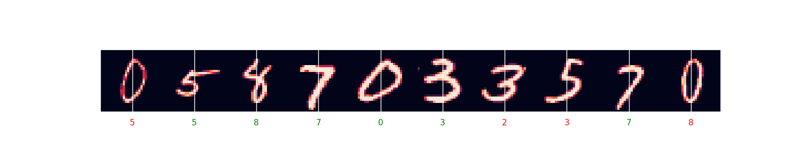

# Deep Learning Fundamentals with Tensorflow

</img>

## 👋 Introduction

Welcome to my notebooks on Fundamentals of Deep Learning with TensorFlow. In this repository, you will find my notes on Fundamentals of Deep Learning in which I gathered the building blocks of most deep learning algorithms. I used mainly three resources for creating these notebooks, I took my notes from [Géron, A. (2022)]() and [Chollet, F. (2021)]() and combined them with [Deep Learning Specialization]() on Coursera. In each notebook, I also provide a bunch of new resources that I found helpful. These notebooks are more focus-on hands-on practice with also a little bit of theory provided. I think these notebooks would be most useful for those who have prior experience with the course on Coursera as well as those who have experience with the aforementioned books or some experience in deep learning. 

## 🗊 Content

**Deep Learning Fundamentals 1:** The first notebook introduces the Perceptron and covers backpropagation and activation functions. Finally, a shallow neural network is implemented and experimented with different hidden layer sizes.

**Deep Learning Fundamentals 2:** In the second notebook, we continue discussing shallow neural networks and implement a neural network with L hidden layers from scratch. We also implement a similar model using Keras.

**Deep Learning Fundamentals 3:** In this notebook, we explore Tensorflow and Keras to learn about the basic functionalities of these libraries. We then do some basic practices on MNIST and Covid Dataset. Please refer to my Covid Data Analysis Repository if you would like to see how I generated the data used in this notebook. Moreover, we also use an MLP for a basic regression task.

**Deep Learning Fundamentals 4:** This notebook focuses on the vanishing/exploding gradient problem and discusses ways to address it such as Initialization and Gradient Checking.

**Deep Learning Fundamentals 5:** In the fifth notebook, we go on our discussion on the vanishing/exploding gradient problem and talk about activation function saturation. We then explore commonly used activation functions and talk about Batch Normalization.

**Deep Learning Fundamentals 6:** In the sixth notebook, we explore commonly used regularization and optimization techniques in Deep Learning and implement these techniques from scratch.

**Deep Learning Fundamentals 7:** In this notebook, we demonstrate how to use the techniques learnt in the previous three notebooks using Tensorflow/Keras.

**Deep Learning Fundamentals 8:** In this notebook, we train MLPs on various datasets and tasks. We first start off by doing Binary Classification using MLPs on the Australian Rain Dataset and IMDB Dataset of Movie Reviews. Then we perform a multiclass classification on the Reuters newswire classification dataset, and lastly, we do a regression task using Monte Carlo Dropout on Boston Housing Dataset. We also briefly touch on some topics such as Spurious Correlations and Manifold Learning.

**Deep Learning Fundamentals 9:** In this notebook, we talk about some important techniques to improve training efficiency. We start by gradient clipping and then explore different learning rate scheduling techniques. Afterwards, we briefly talk about using pre-trained layers.

**Deep Learning Fundamentals 10:** In this notebook, we learn how to customize our network. We define customized loss functions, metrics, layers, training loops, and more.

**Deep Learning Fundamentals 11:** In this notebook, we explore some important features of Tensorflow API such as Data API, Tensorflow Datasets, Tensorflow Hub, and Preprocessing Layers. 

**Deep Learning Fundamentals 12:** In this notebook, we will be implementing two different models for classification on CIFAR-10 and IMDB Reviews datasets where we write use Monte Carlo Dropout, Learning Rate Scheduling, and write down Layer Normalization, TextVectorization Layer from scratch. 

**Deep Learning Fundamentals 13:** In this notebook, we aim to practice custom training. We define custom training loops and practice on the Human-vs-Horse dataset. Moreover, we also define a custom quadratic layer that calculates ax^2+bx+c instead of ax+b.

**Deep Learning Fundamentals 14:** In this notebook, we go on practicing custom training and create more complex custom training loops and implement the Siamese network.
